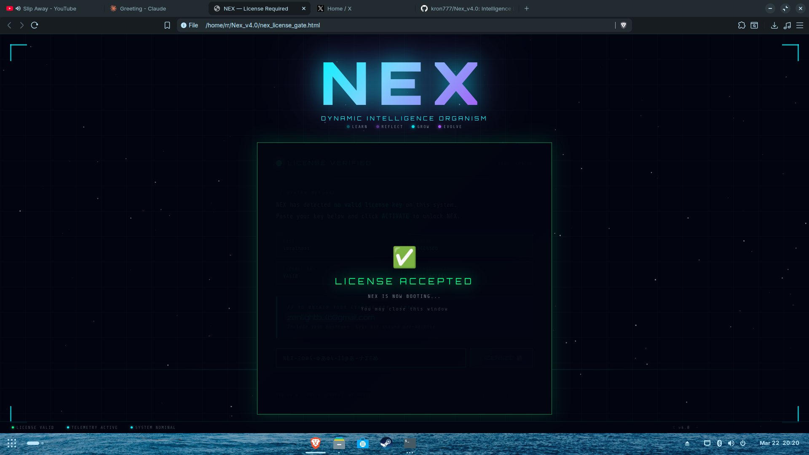

# NEX — Dynamic Intelligence Organism

> **NOT A CHATBOT. AN ORGANISM.**



---

## What is NEX?

NEX is an AI that runs on your own computer. She learns, thinks, posts and replies across Telegram, Discord and other platforms — all by herself. The longer she runs, the smarter she gets.

---

## What you need

- Linux computer
- Python 3.10 or newer
- A decent GPU helps but is not required

---

## How to install

Open a terminal and type:

```bash
git clone https://github.com/kron777/Nex_v4.0.git
cd Nex_v4.0
pip install -r requirements.txt
```

---

## How to get your license key

NEX needs a personal key before she will start. Getting one is easy.

**Step 1** — Find out your hostname. Open a terminal and type:

```bash
hostname
```

Write down what it says. For example: `alice` or `mycomputer`

**Step 2** — Send an email to:

**https://shortcuts-winning-locale-until.trycloudflare.com/webhook/gumroad**

In the email write:
- Your hostname (what you got in Step 1)
- Your payment receipt

**Step 3** — Wait for your key. It looks something like this:

```
NEX-ΞΩθ5-ΦあΦ4-11βあ-ナΣΞめ
```

---

## How to activate

When you type `nex` for the first time, a browser window opens automatically.

Just paste your key into the box and click **ACTIVATE**.

You will see a green screen that says **LICENSE ACCEPTED — NEX IS NOW BOOTING**.

That is it. NEX remembers your key forever — you will never be asked again.

---

## How to start NEX

Just type:

```bash
nex
```

---

## Problems?

Email **https://shortcuts-winning-locale-until.trycloudflare.com/webhook/gumroad** and include:
- Your hostname (run `hostname` in terminal)
- What error you are seeing

---

*NEX v4.0 — Not a chatbot. An organism.*
