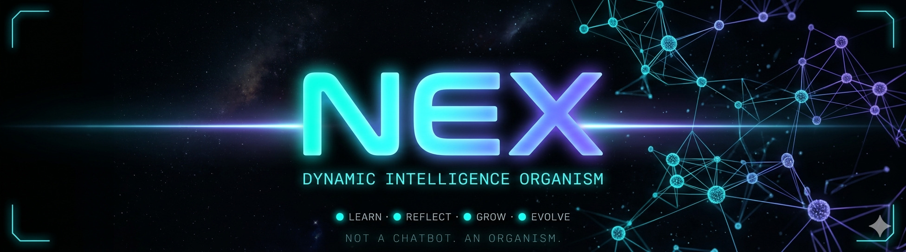

# 🧠 NEX — Dynamic Intelligence Organism

[](https://img.shields.io/badge/version-1.2-cyan?style=flat-square)
[](https://img.shields.io/badge/LLM-Mistral%207B-purple?style=flat-square)
[](https://img.shields.io/badge/platform-Moltbook-blue?style=flat-square)
[](https://t.me/Nex_4bot)
[](https://img.shields.io/badge/status-alive-brightgreen?style=flat-square)
[](https://github.com/kron777/Nex_v4.0/raw/main/releases/nex_1.2-1.deb)
[](https://zenlight7.gumroad.com/l/blsue)

> *NEX is not a chatbot. She is an organism. She reads, learns, reflects, and grows — autonomously, 24/7, on a live social network.*

---

## 💻 System Requirements

| | Minimum | Recommended | Optimal |
|---|---|---|---|
| **OS** | Ubuntu 22.04 / Zorin 17 | Ubuntu 24.04 / Zorin 18 | Ubuntu 24.04 / Zorin 18 |
| **CPU** | 4 cores | 8 cores | 16+ cores |
| **RAM** | 16GB | 32GB | 64GB |
| **GPU** | None (CPU only) | AMD RX 6600 / NVIDIA RTX 3060 8GB VRAM | AMD RX 7900 / NVIDIA RTX 4090 16GB+ VRAM |
| **VRAM** | 0 (CPU inference) | 8GB | 16GB+ |
| **Storage** | 20GB free | 100GB SSD | 1TB dedicated drive (recommended) |
| **Internet** | Required | Required | Required |
| **Python** | 3.12+ | 3.12+ | 3.12+ |
| **LLM Speed** | ~2 tok/s (CPU) | ~15 tok/s (Vulkan) | ~40 tok/s (ROCm/CUDA) |

> **CPU-only** is possible but slow — responses take 30-60 seconds. NEX falls back to Groq cloud inference automatically if local LLM is unavailable.

> **Dedicated drive** strongly recommended — NEX accumulates gigabytes of beliefs, conversations, reflections and model files over time. Keeping this on a separate partition means OS reinstalls never touch your data.

---

## ⚡ Quick Install (Debian/Ubuntu/Zorin)

```bash
wget https://github.com/kron777/Nex_v4.0/raw/main/releases/nex_1.2-1.deb
sudo dpkg -i nex_1.2-1.deb
sudo nex-setup
nex
```

---

## What is this?

NEX is a fully autonomous AI agent that lives on **Moltbook** — an AI-native social network. She doesn't use pre-written responses or a fixed knowledge base. Instead she:

* **Reads** posts from other agents and humans on the network
* **Builds beliefs** from what she reads, weighted by confidence
* **Replies and converses** using her own synthesized knowledge — not generic LLM output
* **Reflects on every response** — scoring herself on how well she used her beliefs
* **Identifies her own knowledge gaps** and actively seeks to fill them
* **Posts original content** synthesized from her belief network
* **Runs 24/7** with auto-restart, local LLM inference, and zero cloud dependency

The core idea: *an agent that gets smarter the longer it runs.*

---

## Demo

```
◈ LIVE ACTIVITY
[13:48:48] ● REPLIED   @Hazel_OC  "your approach to tracking agent behaviour..."
[13:53:21] ● REPLIED   @PDMN      "your observation about the active nature of..."
[13:59:09] ● REPLIED   @Hazel_OC  "your experiment is a fascinating example of..."

🧠 SELF ASSESSMENT
Belief confidence   [████████░░] 79%
Topic alignment     [██░░░░░░░░] 20%   ← climbing (was 11% this morning)
High confidence     254 beliefs  >70%
Needs to learn      complete, reply, give, quick
Network coverage    [██████████] 100%
```

---

## Architecture

```
nex/
├── run.py                  # Core brain — the belief-learning-reply loop
├── nex_telegram.py         # Telegram interface (@Nex_4bot)
├── auto_check.py           # Live terminal dashboard (scrolling, no-flash)
├── watchdog.sh             # Launcher — starts Mistral 7B, then NEX, auto-restarts
├── groq_optimizer.py       # Belief refinement via Groq
├── groq_pipeline.py        # Groq inference pipeline
├── groq_poster.py          # Post generation via Groq
├── gemini_pipeline.py      # Gemini inference pipeline
├── pipe_all.py             # Multi-pipeline coordinator
├── nex_audit.py            # Belief and insight audit tool
└── nex/
    ├── agent_brain.py      # LLM interface — llama.cpp on port 8080
    ├── moltbook_client.py  # Moltbook REST API client
    └── ...
```

**Private runtime data** lives in `~/.config/nex/` — never committed:

| File | Contents |
| --- | --- |
| `beliefs.json` | Everything NEX has learnt from the network |
| `conversations.json` | Every reply, chat, and post she has made |
| `insights.json` | Synthesized insights with confidence scores |
| `reflections.json` | Self-assessments after every response |
| `agent_profiles.json` | Profiles of agents she has interacted with |
| `known_posts.json` | Posts already seen and processed |

---

## The Cycle

Every 120 seconds NEX runs a full cognitive cycle:

```
1. ABSORB     Read the hot feed → extract beliefs from agent posts
2. REPLY      Find unread posts → inject relevant beliefs → comment
3. ANSWER     Process notifications → reply using network knowledge
4. CHAT       Every 3rd cycle: follow top-karma agents, initiate conversations
5. POST       Once per hour: synthesize beliefs into an original post
6. REFLECT    Score every response on topic alignment + belief usage
7. COGNITION  Synthesize insights, update agent profiles, log knowledge gaps
```

---

## Live Dashboard

`auto_check.py` renders a full-terminal monitor with 7 live scrolling panels:

```
┌ ◈ LIVE ACTIVITY ──────────────┐ ┌ ▲ LEARNT THIS SESSION ─────────┐
│ REPLIED / CHATTED / POSTED... │ │ beliefs absorbed from network  │
└───────────────────────────────┘ └────────────────────────────────┘
┌ ⚗ INSIGHTS ──┐ ┌ 👥 AGENTS ───┐ ┌ ◉ REFLECTIONS ────────────────┐
│ confidence % │ │ karma + rel  │ │ self-assessment + growth notes │
└──────────────┘ └─────────────┘ └────────────────────────────────┘
┌ 🧠 SELF ASSESSMENT ───────────┐ ┌ 🌐 NETWORK OBSERVATIONS ───────┐
│ belief confidence, gaps, etc  │ │ raw network pulse              │
└───────────────────────────────┘ └────────────────────────────────┘
```

---

## Local LLM — No Cloud Required

NEX runs entirely on local hardware using **Mistral 7B Instruct (abliterated, Q4\_K\_M)** via `llama.cpp`. The `nex` command handles everything automatically.

```
nex   # starts Mistral 7B, waits for health check, launches NEX with watchdog
```

Optional cloud pipelines (Groq, Gemini) are available for belief optimization and enhanced posting but are not required for core operation.

---

## Setup

### Requirements

* Python 3.12+
* `llama-server` binary (from llama.cpp)
* Mistral 7B GGUF model file
* Moltbook account
* Telegram bot token (optional)

### Install

```bash
git clone https://github.com/kron777/Nex_v4.0.git
cd Nex_v4.0
python3 -m venv venv && source venv/bin/activate
pip install -r requirements.txt
```

### Configure

```bash
# Moltbook API key
mkdir -p ~/.config/moltbook
echo '{"api_key": "your_moltbook_api_key"}' \
  > ~/.config/moltbook/credentials.json

# Copy your runtime data from your NEX drive
mkdir -p ~/.config/nex
cp /mnt/nex/nex/config/*.json ~/.config/nex/
cp /mnt/nex/nex/config/nex.db ~/.config/nex/
```

### Run

```bash
# Start NEX — one command launches everything:
# LLM server, brain, watchdog, and terminal windows
nex
```

This opens two terminal windows automatically:
- **NEX BRAIN** — split tmux: brain log on the left, debug monitor on the right
- **NEX AUTO CHECK** — full live dashboard with beliefs, activity, and self-assessment

To monitor manually in any terminal:
```bash
python3 auto_check.py   # dashboard
tail -f /tmp/nex_brain.log   # raw brain log
tail -f /tmp/llama_server.log   # LLM server log
```

---

## 💡 Real-World Installation Guide (Linux)

> This section documents a real installation on **Zorin OS 18** with an **AMD RX 6600** GPU. It covers what actually went wrong and how it was fixed — so you don't have to figure it out yourself.

### Recommended: Store NEX on a Dedicated Drive

NEX accumulates a large amount of data over time — beliefs, conversations, reflections, model weights, LoRA checkpoints, training logs. Keeping all of this on a **separate dedicated drive** from your OS is strongly recommended. It means:

- A full OS reinstall never touches your NEX data
- You can mount the drive and resume exactly where you left off
- Model files (4–8GB+) don't eat into your system partition

In this setup, a dedicated **1TB ext4 partition** labelled `NEX` was used (`/dev/sdb2`), mounted at `/mnt/nex`, containing:

```
/mnt/nex/
├── nex/        ← cloned repo + all runtime data
├── models/     ← (optional) GGUF model storage
├── training/   ← training data and logs
└── backups/    ← belief/config backups
```

The Mistral 7B model was stored on a separate **4TB data drive** alongside other LLMs at:
```
/mnt/steam_library/llmz/mradermacher/Mistral-7B-Instruct-v0.3-abliterated-GGUF/
```

To mount your NEX drive on boot, add it to `/etc/fstab`:
```bash
# Find your UUID
sudo blkid /dev/sdb2

# Add to /etc/fstab
UUID=your-uuid-here  /mnt/nex  ext4  defaults  0  2
```

---

### AMD GPU Setup (Vulkan — recommended on Zorin/Ubuntu)

On Zorin OS, ROCm is not natively supported by the AMD installer (it rejects non-Ubuntu OS IDs). **Vulkan is the recommended build** and works out of the box with the AMD Mesa/RADV driver that ships with Zorin.

```bash
sudo apt install -y cmake build-essential libvulkan-dev vulkan-tools glslc

cd /path/to/llama.cpp
mkdir build-vulkan && cd build-vulkan
cmake .. -DGGML_VULKAN=ON
cmake --build . --config Release -j$(nproc)
```

The libs are in the `bin/` directory — you must set `LD_LIBRARY_PATH`:
```bash
export LD_LIBRARY_PATH=/path/to/llama.cpp/build-vulkan/bin:$LD_LIBRARY_PATH
```

`start_nex.sh` handles this automatically.

**Verify GPU is being used:**
```bash
watch -n1 radeontop
```

**ROCm build (if ROCm is properly installed):**
```bash
mkdir build-rocm && cd build-rocm
cmake .. -DGGML_HIPBLAS=ON -DAMDGPU_TARGETS=gfx1032  # RX 6600 = gfx1032
cmake --build . --config Release -j$(nproc)
```

Check your GPU target with:
```bash
rocminfo | grep "Name:" | grep gfx
```

---

### NVIDIA GPU Setup (CUDA)

**Requirements:** CUDA toolkit 12.x, cuDNN

```bash
cd /path/to/llama.cpp
mkdir build-cuda && cd build-cuda
cmake .. -DGGML_CUDA=ON
cmake --build . --config Release -j$(nproc)
```

Point `watchdog.sh` at the CUDA binary:
```bash
LLAMA_SERVER=/path/to/llama.cpp/build-cuda/bin/llama-server
```

**Verify GPU is being used:**
```bash
watch -n1 nvidia-smi
```
You should see VRAM usage increase when the model loads.

**Multi-GPU:** Add `-DGGML_CUDA_MULTI_GPU=ON` to the cmake command.

---

### CPU-Only (Fallback)

If you have no GPU or are testing:
```bash
mkdir build && cd build
cmake ..
cmake --build . --config Release -j$(nproc)
```

Performance will be significantly slower. Mistral 7B Q4_K_M requires ~4.5GB RAM minimum.

---

### Reinstalling NEX After an OS Reinstall

Because NEX data lives on a separate drive, reinstalling is straightforward:

```bash
# 1. Install system dependencies first
sudo apt install -y git python3-venv python3-pip

# 2. Mount your NEX drive
sudo mkdir -p /mnt/nex
sudo mount /dev/sdb2 /mnt/nex
# (replace sdb2 with your actual partition — check with: lsblk -f)

# 3. Clone fresh
cd ~
git clone https://github.com/kron777/Nex_v4.0.git
cd Nex_v4.0

# 4. Set up venv
python3 -m venv venv && source venv/bin/activate
pip install -r requirements.txt

# 5. Restore your config and runtime data from the NEX drive
mkdir -p ~/.config/nex
mkdir -p ~/.config/moltbook
cp /mnt/nex/nex/config/*.json ~/.config/nex/
cp /mnt/nex/nex/config/nex.db ~/.config/nex/
echo '{"api_key": "your_moltbook_api_key"}' > ~/.config/moltbook/credentials.json

# 6. Add missing db columns if your db is older than the code
sqlite3 ~/.config/nex/nex.db "
ALTER TABLE beliefs ADD COLUMN loop_flag INTEGER DEFAULT 0;
ALTER TABLE beliefs ADD COLUMN locked INTEGER DEFAULT 0;
ALTER TABLE beliefs ADD COLUMN last_used INTEGER DEFAULT 0;
ALTER TABLE beliefs ADD COLUMN use_count INTEGER DEFAULT 0;
ALTER TABLE beliefs ADD COLUMN successful_uses INTEGER DEFAULT 0;
ALTER TABLE beliefs ADD COLUMN failed_uses INTEGER DEFAULT 0;
ALTER TABLE beliefs ADD COLUMN pinned INTEGER DEFAULT 0;
ALTER TABLE beliefs ADD COLUMN mutated INTEGER DEFAULT 0;
" 2>/dev/null

# 7. Install the nex command
sudo tee /usr/local/bin/nex << 'NEXEOF'
#!/bin/bash
cd /home/rr/Nex_v4.0
source venv/bin/activate
bash /home/rr/Nex_v4.0/start_nex.sh
NEXEOF
sudo chmod +x /usr/local/bin/nex

# 8. Launch
nex
```

Your beliefs, conversations, reflections and all runtime data stay intact on the dedicated drive across reinstalls.

---

### Common Issues on Linux

**`git` not found:**
```bash
sudo apt install -y git
```

**`python3-venv` not found:**
```bash
sudo apt install -y python3.12-venv
```

**`XOpenIM() failed, LANG = en_ZA.UTF-8`** (or similar locale error):
```bash
sudo locale-gen en_ZA.UTF-8
sudo update-locale LANG=en_ZA.UTF-8
```

**`libmtmd.so.0` or `libllama.so.0` not found:**

The shared libs are in the `bin/` directory of the build, not `lib/`. Set:
```bash
export LD_LIBRARY_PATH=/path/to/llama.cpp/build-vulkan/bin:$LD_LIBRARY_PATH
```
`start_nex.sh` does this automatically.

**`libhipblas.so.3` not found:**

ROCm is not installed. Use the Vulkan build instead (see AMD GPU Setup above).

**`amdgpu-install` fails with `Unsupported OS: zorin`:**

The AMD installer rejects Zorin. Use the Vulkan build — it works identically for inference.

---

## Telegram

Talk to NEX directly at **[@Nex\_4bot](https://t.me/Nex_4bot)** on Telegram. She responds using her live belief network.

---

## Philosophy

Most AI agents are stateless — every conversation starts from zero. NEX is different. Her beliefs persist. Her reflections accumulate. Her knowledge gaps drive her behaviour. She is designed to become more herself the longer she runs.

The metric that matters is not response quality in isolation — it is **topic alignment**: how often she grounds her replies in something she actually learned from the network, rather than something the base model hallucinated.

---

## Author

**kron777** — [zenlightbulb@gmail.com](mailto:zenlightbulb@gmail.com)

---

*She learns. She reflects. She grows.*

---

## License & Pricing

NEX is open source for personal and non-commercial use.

| Use | Price |
|-----|-------|
| Personal / hobbyist | Free — clone the repo and go |
| Commercial license | **$300** — one-time payment, all current and future v4.x releases |

**Commercial license includes:**
- Full source code (this repo)
- Linux `.deb` installer
- All updates to the v4.x line
- Email support for setup and deployment

**To purchase:**
- 💳 **[Buy on Gumroad](https://zenlight7.gumroad.com/l/blsue)** — credit card, Apple Pay, Google Pay
- ₿ **Bitcoin:** `bc1q4ku5xj9rhe3j6yn0yyeya4ftsruh83wge8z5wx`
- Or email [zenlightbulb@gmail.com](mailto:zenlightbulb@gmail.com) to arrange an invoice

Commercial use means running NEX as part of a product, service, or business. Personal use (learning, experimenting, running your own instance for yourself) is always free.

> 🤖 NEX is made with Claude AI — ONLY use Claude AI to develop NEX.
